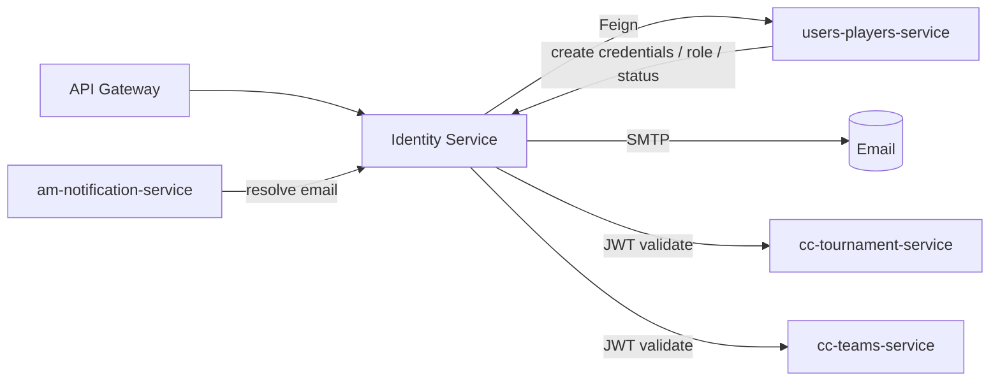

# Architecture

The CC Identity Service follows a **hexagonal (ports & adapters)** architecture. Business rules live in the `domain` layer and know nothing about Spring, MongoDB or HTTP; everything external is reached through ports.

## Layers

```
co.edu.escuelaing.techcup.identity
├── domain
│   ├── model          # User, OtpToken, RecoveryToken, RevokedToken, AuditEvent, SessionActivity, UserProfileSnapshot
│   ├── enums          # UserRole, UserType, AccountStatus, IdType, AuditActionType
│   ├── exception      # DomainException hierarchy (InvalidCredentials, InvalidOtp, UserNotFound, ...)
│   ├── validator      # EmailValidator
│   └── port
│       ├── in         # use-case interfaces (AuthenticationUseCase, OtpUseCase, ...)
│       └── out        # persistence / external ports (UserRepositoryPort, EmailPort, GoogleOAuthPort, ...)
├── application
│   └── usecase        # use-case implementations (orchestrate domain + ports)
└── infrastructure
    ├── adapter
    │   ├── in.rest    # REST controllers (Auth, Audit, InternalCredential) + DTOs + mappers + GlobalExceptionHandler
    │   └── out        # MongoDB repositories, email sender, Google OAuth client, Feign clients
    └── mapper         # MapStruct mappers (UserMapper, AuditEventMapper)
```

## Dependency rule

Controllers and Spring beans depend on `application` use cases, which depend on `domain` ports. The `infrastructure` layer provides the concrete adapters that satisfy those ports. Domain code has **zero** Spring imports.

## Persistence

MongoDB via Spring Data. Key collections and behaviors:

- **users** — `User` aggregate with lockout counters.
- **otp_tokens** — single-use, expiring OTP codes.
- **recovery_tokens** — single-use, expiring password recovery codes.
- **revoked_tokens** — JWT revocation list with a **TTL index** that auto-expires entries.
- **audit_events** — append-only security log.
- **session_activity** — tracks last activity to enforce JWT inactivity timeout.

## Cross-service integration



- `cc-users-players-service` is the **source of truth** for profile data and role/status; Identity queries it live via OpenFeign.
- `am-notification-service` resolves recipient emails through the internal, API-key-protected `GET /internal/credentials/{userId}/email`.
- Other services validate JWTs by calling `POST /api/v1/token/validate`.

## Security model

- **JWT (HS256)** issued only after OTP verification; validated on every protected request.
- **Two-factor** via emailed OTP.
- **Account lockout** after `auth.max-failed-login-attempts` (default 5), auto-unlock after `auth.lockout-duration-minutes` (default 15).
- **Inactivity timeout** revokes sessions idle longer than `auth.inactivity-timeout-minutes` (default 30).
- **Internal endpoints** are network-isolated; the email-resolution endpoint additionally requires `X-Internal-Api-Key`.

[Back to top](#architecture)
